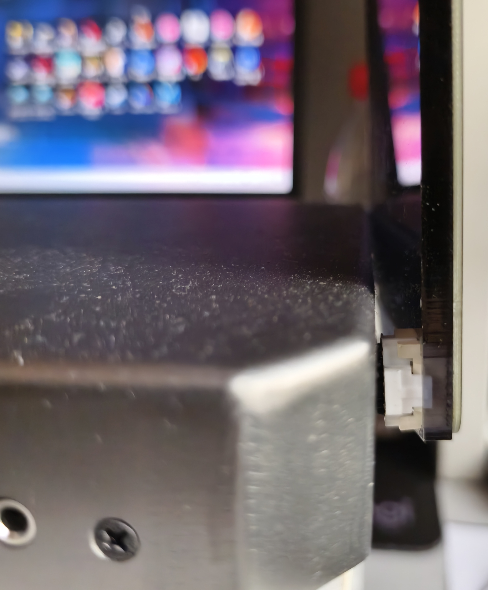
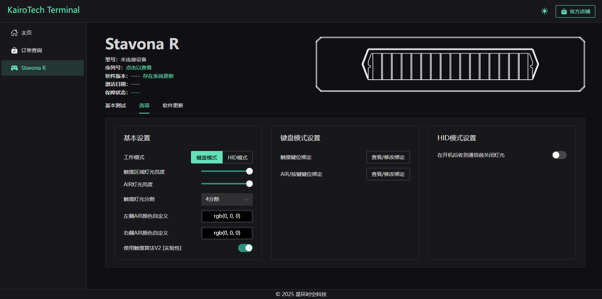
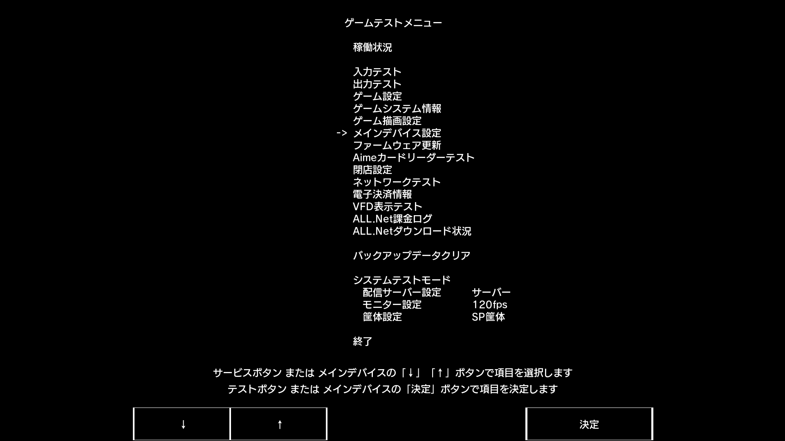
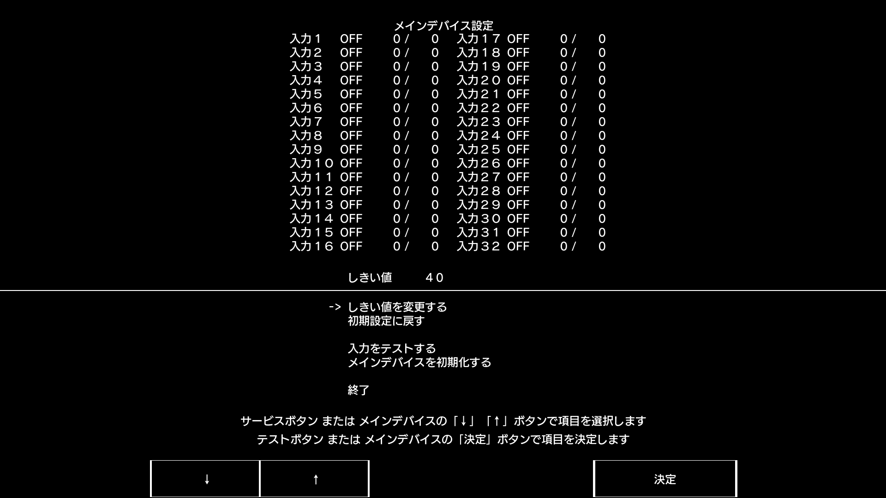

# Stavona R V2 使用指南/Guide
[V1更换IO板戳我](https://github.com/HajiAIqaq/Stavona-R-Guide/blob/main/%E6%9B%B4%E6%8D%A2IO%E6%9D%BF/Stavona%20R%20V1%20%E6%9B%B4%E6%8D%A2IO%E6%9D%BF%E8%AF%A6%E7%BB%86%E6%8C%87%E5%8D%97.md)
### 特点/Features

- 独特外壳设计，外形更加炫酷
- 采用 USB Type-B 接口，相比 Type-C 更加坚固稳定，适合高频率插拔
- 多次迭代的触摸算法，与GROUND SLIDER相似的触摸算法，最大程度地还原官机体验
- 紧凑扎实的内部结构，确保低噪与高稳定性

## 简易安装游玩教程

1. 开箱并组装手台
2. 调节手台软件设置
3. 游戏软件设置

## 开箱并组装手台/Unbox & Assemble

首先从包装箱里取出控制器，平放到桌面上。取出两个高度感应器，将触摸板部分的扎带取下，小心地将连接线卡入槽中，听到“咔哒”一声即表示安装到位，并将长出来的部分连接线塞回控制器内。使用附送的手拧螺丝将高度感应器固定在控制器上，通过所附送线材连接至您的电脑




> [!WARNING]
>
> 如果您是**台式机**，请将控制器连接到主机背面的USB接口
>
> 如果您是**笔记本**，直接连接到笔记本的USB接口即可
>
> 请勿使用拓展坞，以免造成供电或通信不稳定
>
> 稳定连接是良好游玩体验的基础，请确保 USB 接口供电充足

## 调节手台软件设置/Settings

Stavona R V2已支持WebHID控制中心

[Stavona R 控制中心](https://terminal.kairotech.net/stavona-r)

请通过网页控制中心选择所需的运行模式



**键盘模式**支持设置键盘映射以支持多种节奏游戏

**HID模式**与segatools的stavona IO对接，实现更好的游玩体验

## 游戏软件设置/Game settings

关于游戏的下载与启动教程

[Performai Manual](https://performai.evilleaker.com/manual/)

假设您已经下载好游戏并完成了键盘操作的基本启动设置，请于Release下载最新的StavonaIO.dll，并在控制中心中将手台的操作模式调节至HID模式

以下是segatools.ini设置

```ini
[chuniio]
; If you wish to sideload a different chuniio, specify the DLL path here
path=StavonaIO.dll
[StavonaIO]
reportTime=20
```

> [!NOTE]
>
> 适用于"V1触摸算法"的额外设置

打开游戏，按手台功能区的第一个按钮进入Test模式，通过功能区按钮或触摸板，在游戏的测试选项中选择メインデバイス設定



将「しきい値」设置为 40（此为触摸灵敏度阈值）



选择終了，返回游戏开始页面，Enjoy your controller！

CHUNITHM及其商标**®**版权应于SEGA所有，对其软件的使用，修改等行为具有法律风险，软件仅供学习交流使用
