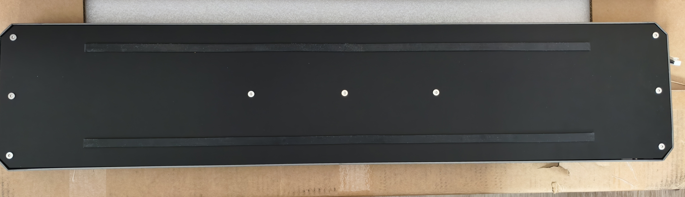
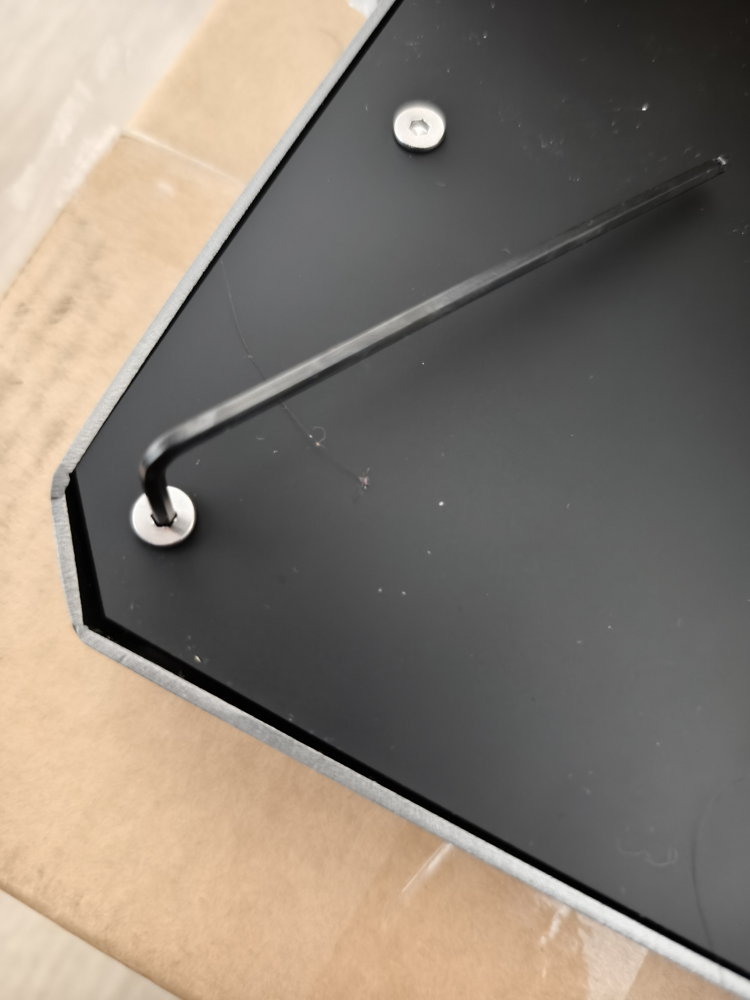
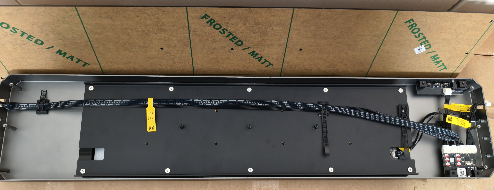
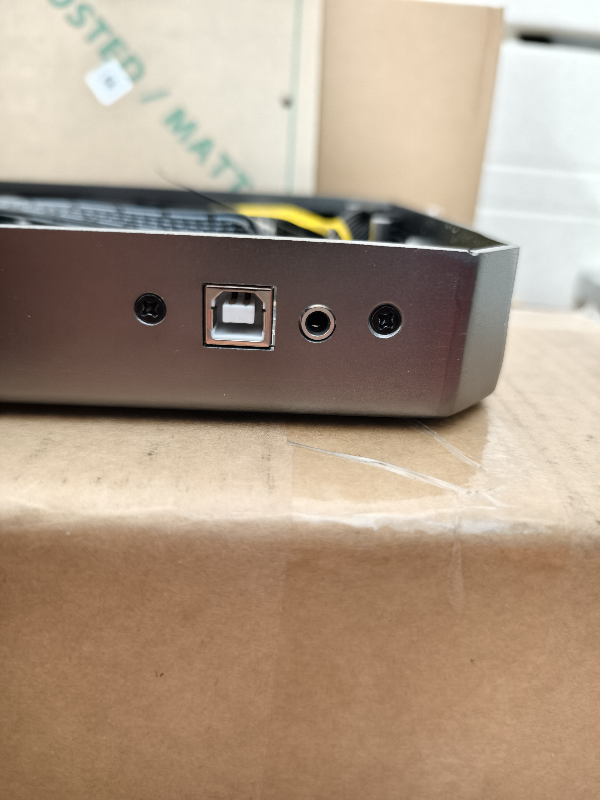
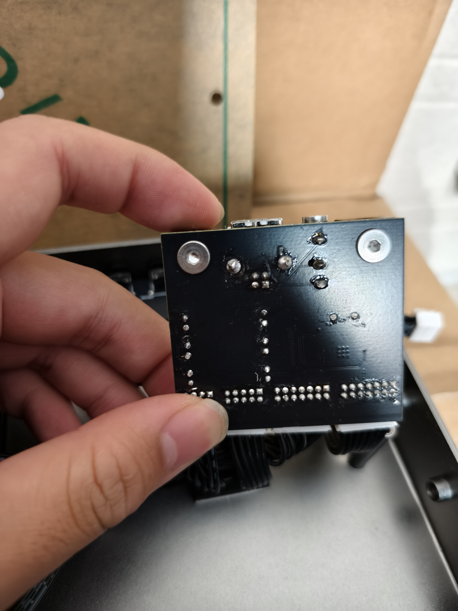
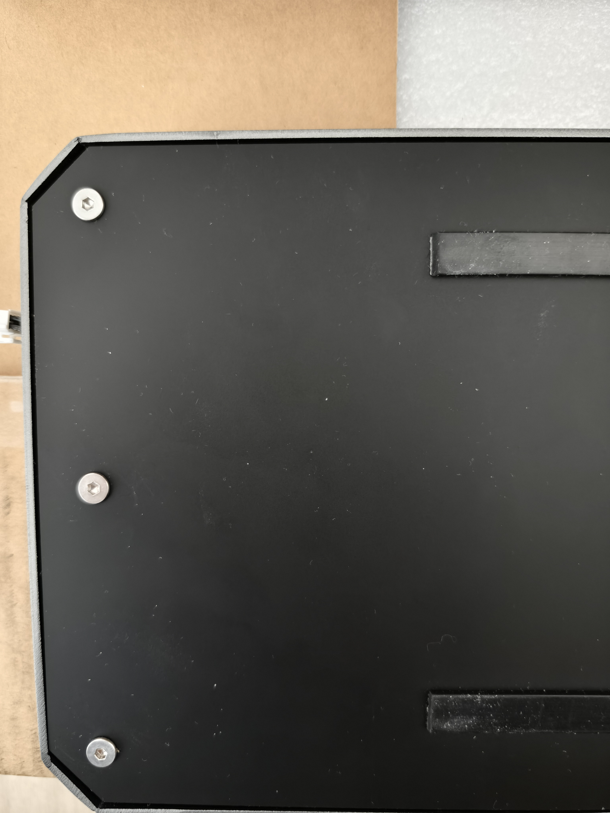
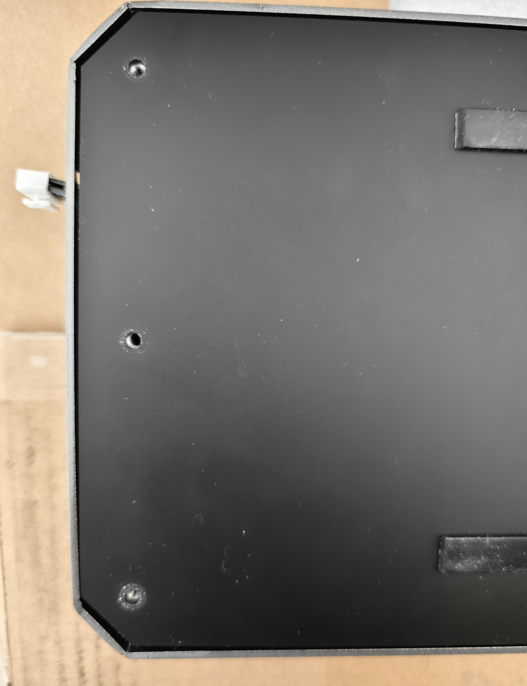
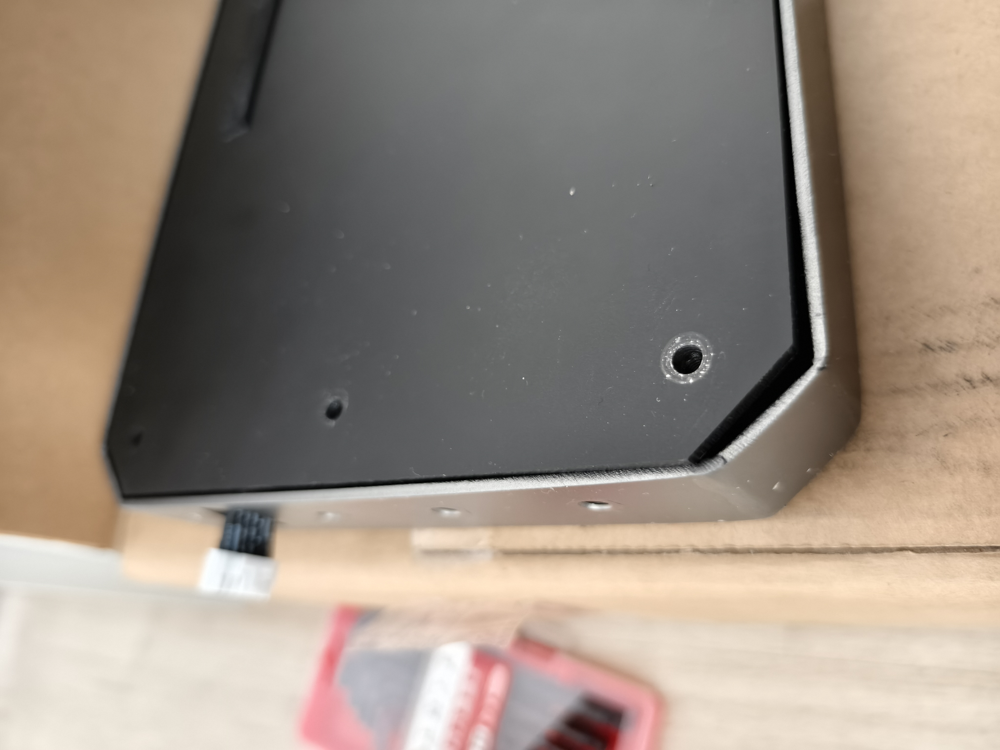

# Stavona R V1 更换 IO 板详细指南

**适用于因芯片锁死需更换 IO 板的用户**

> [!WARNING]  
> 在操作前，请务必洗手或佩戴防静电手环，以防静电损坏电子元件

---

## 步骤 1：拆下 Air 组件并倒置控制器  

---

## 步骤 2：使用附赠的 H2.5 内六角扳手拆下背面 9 颗螺丝（顺序不限）  

---

## 步骤 3：利用背部防滑条轻轻掀开背板  

---

## 步骤 4：卸下 IO 板固定螺丝并拔除所有连接线缆  

---

## 步骤 5：拧下 IO 板下方六角螺丝，卸下金属小方块，并预备安装至新 IO 板  

---

## 步骤 6：连接新 IO 板至线缆并固定，随后将背板装回  

> [!IMPORTANT]  
> **背板安装注意事项**  
>
> 由于本批次控制器存在一定公差，可能导致背板安装困难。推荐方法如下：  
> - 先抬起控制器一侧，安装该侧的螺丝；  
> - 用手按压另一侧将其压平；  
> - 等所有螺丝对齐插入后，再进行拧紧；  
> - 请勿一开始就拧紧任一侧螺丝，以避免卡壳或变形

---

  

---

## ✅ 更换完成检查提示

请确认以下项目是否完成：  
- 所有线缆已连接牢固，接口无松动  
- 所有螺丝均已正确安装并拧紧  
- 控制器通电后能正常识别 IO 板并连接到软件  

如遇识别问题，请再次检查连接及 IO 模块状态。
